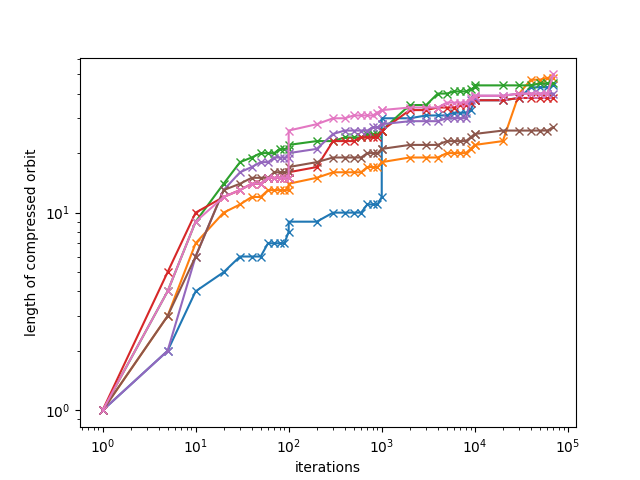

# PASToRe

**PASToRe** is a Python implementation of the CASToRe compression algorithm.

This repository includes a small reproduction of an entropy measurement of the Manneville map from [this paper](https://doi.org/10.48550/arXiv.math/0107067) as an example use of PASToRe.

